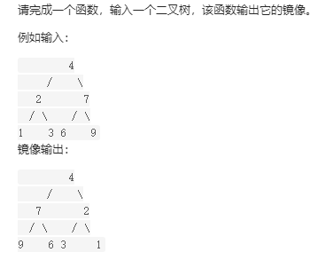

# 面试题27：二叉树的镜像

【题目】请完成一个函数，输入一个二叉树，该函数输出它的镜像。


【例如】



```python
输入：root = [4,2,7,1,3,6,9]
输出：[4,7,2,9,6,3,1]
```


LeetCode:[二叉树的镜像](https://leetcode-cn.com/problems/er-cha-shu-de-jing-xiang-lcof/)


**解题思路**  ：根据二叉树镜像的定义，考虑递归遍历（dfs）二叉树，交换每个节点的左 / 右子节点，即可生成二叉树的镜像。

1、递归解析：
终止条件： 当节点 rootroot 为空时（即越过叶节点），则返回 nullnull ；

2、递推工作：
初始化节点 tmptmp ，用于暂存 rootroot 的左子节点；
开启递归 右子节点 mirrorTree(root.right)mirrorTree(root.right) ，并将返回值作为 rootroot 的 左子节点 。
开启递归 左子节点 mirrorTree(tmp)mirrorTree(tmp) ，并将返回值作为 rootroot 的 右子节点 。


```Python
# Definition for a binary tree node.
class TreeNode:
    def __init__(self, x):
        self.val = x
        self.left = None
        self.right = None

class Solution:
    def mirrorTree(self, root: TreeNode) -> TreeNode:
        if root==None:
            return None
        item=root.left
        root.left=self.mirrorTree(root.right)
        root.right=self.mirrorTree(item)
        return root     
```


