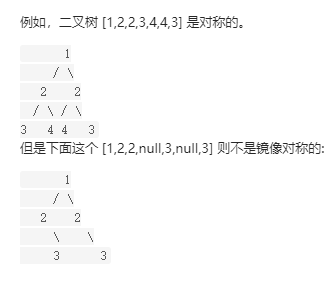

# 面试题 28： 对称的二叉树

【题目】请实现一个函数，用来判断一棵二叉树是不是对称的。如果一棵二叉树和它的镜像一样，那么它是对称的。

【例如】




```python
输入：root = [1,2,2,3,4,4,3]
输出：true

输入：root = [1,2,2,null,3,null,3]
输出：false
```


LeetCode: [对称的二叉树](https://leetcode-cn.com/problems/dui-cheng-de-er-cha-shu-lcof/)


**解题思路**  ：二叉树序列化

1、先采用先序遍历的方式，节点遍历顺序为：中左右，对二叉树进行序列化。

2、对先序遍历方法进行修改，节点遍历顺序为：中右左，然后对二叉树进行序列化。

若二叉树是对称二叉树，那么这两种方法序列化所得到结果应该是一致的。


```Python
# Definition for a binary tree node.
class TreeNode:
    def __init__(self, x):
        self.val = x
        self.left = None
        self.right = None

class Solution:
    def isSymmetric(self, root: TreeNode) -> bool:
        if root==None:
            return True
        
        #二叉树的先序遍历序列化，中左右
        string1=self.preTreeNode(root).split("!")
        #二叉树的先序遍历序列化进行修改，中右左
        string2=self.preTreeNode2(root).split("!")

        if string1==string2:
            return True
        else:
            return False
    

    #二叉树的先序遍历序列化,顺序：中左右
    def preTreeNode(self,node):
        if node==None:
            return "#!"
        string=""
        string=string+str(node.val)+"!"
        string=string+str(self.preTreeNode(node.left))
        string=string+str(self.preTreeNode(node.right))
        return string
    
    #对二叉树的先序遍历序列化进行修改,顺序：中右左
    def preTreeNode2(self,node):
        if node==None:
            return "#!"
        string=""
        string=string+str(node.val)+"!"
        string=string+str(self.preTreeNode2(node.right))
        string=string+str(self.preTreeNode2(node.left))
        return string
      
```


