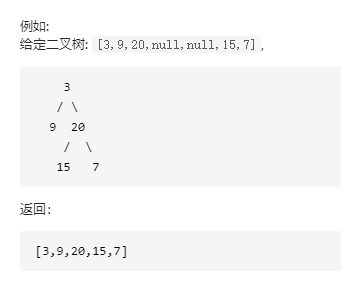

# 面试题32：从上到下打印二叉树

【题目一】从上到下打印出二叉树的每个节点，同一层的节点按照从左到右的顺序打印。


例如:给定二叉树: [3,9,20,null,null,15,7]



返回：[3,9,20,15,7]


LeetCode:[从上到下打印二叉树](https://leetcode-cn.com/problems/cong-shang-dao-xia-da-yin-er-cha-shu-lcof/)


**解题思路：层次遍历**

采用层次遍历的方法从上到下打印二叉树

**层次遍历的核心思想：** 每次出队一个元素，就将该元素的孩子节点加入队列中，直至队列中元素个数为0时，出队的顺序就是该二叉树的层次遍历结果。


```Python
#函数功能：从上到下打印二叉树
#基本思路：二叉树的层次遍历
class Solution:
    def levelOrder(self, root: TreeNode) -> List[int]:
        if root == None:
            return []
        data = []       # 队列结构
        nodeArray = []  # 层次遍历输出数组
        data.append(root)
        while len(data) > 0:
            node = data.pop(0)
            if node.left != None:
                data.append(node.left)
            if node.right != None:
                data.append(node.right)
            nodeArray.append(node.val)
        return nodeArray
```


