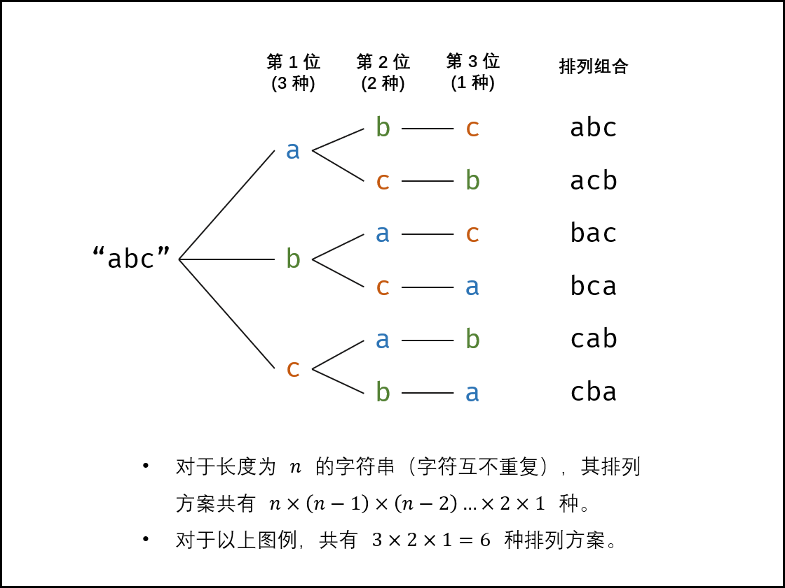
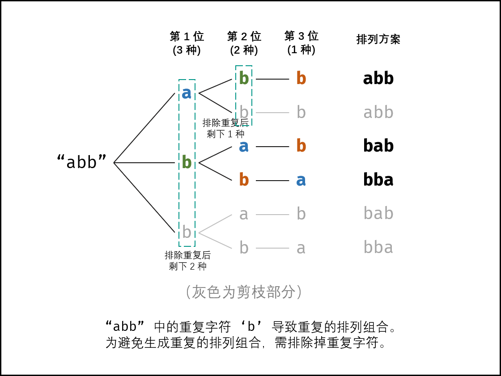

# 面试题38：字符串的排列

【题目】输入一个字符串，打印出该字符串中字符的所有排列。

你可以以任意顺序返回这个字符串数组，但里面不能有重复元素。


**示例:**

```python
输入：s = "abc"
输出：["abc","acb","bac","bca","cab","cba"]
```


LeetCode:[字符串的排列](https://leetcode-cn.com/problems/zi-fu-chuan-de-pai-lie-lcof/)


**解题思路：深度优先遍历**

排列方案数量： 对于一个长度为 nn 的字符串（假设字符互不重复），其排列共有n×(n−1)×(n−2)…×2×1​ 种方案。




排列方案的生成方法： 根据字符串排列的特点，考虑深度优先搜索所有排列方案。即通过字符交换，先固定第 1 位字符（ n 种情况）、再固定第 2 位字符（ n−1 种情况）、... 、最后固定第 n 位字符（ 1 种情况）。


**重复方案与剪枝：**  当字符串存在重复字符时，排列方案中也存在重复方案。为排除重复方案，需在固定某位字符时，保证 “每种字符只在此位固定一次” ，即遇到重复字符时不交换，直接跳过。从 DFS 角度看，此操作称为 “剪枝” 。




**递归解析：**
**终止条件：**  当 x = len(c) - 1时，代表所有位已固定（最后一位只有 11 种情况），则将当前组合 c 转化为字符串并加入 res，并返回；
**递推参数：**  当前固定位 x；
**递推工作：** 初始化一个 Set ，用于排除重复的字符；将第 x 位字符与i∈[x,len(c)] 字符分别交换，并进入下层递归；
**剪枝：**  若 c[i] 在 Set 中，代表其是重复字符，因此“剪枝”；
将 c[i] 加入 Set ，以便之后遇到重复字符时剪枝；
固定字符： 将字符c[i] 和 c[x] 交换，即固定 c[i] 为当前位字符；
开启下层递归： 调用 dfs(x+1) ，即开始固定第x+1 个字符；
还原交换： 将字符 c[i] 和 c[x] 交换（还原之前的交换）；


```Python
class Solution:
    def __init__(self):
        self.res = []                   # 用来存放字符串的全排列

    def permutation(self, s: str) -> List[str]:
        string = list(s)                # 将字符串数据转成列表格式

        if len(string) == 1:
            return string
        elif len(string) == 0:
            return None

        self.dfs(string, 0)             # 开始深度优先遍历
        return self.res

    # 深度优先遍历
    def dfs(self, string, index):
        if index == len(string) - 1:    # 已经遍历到最后一位了， 添加排列方案
            res = ""                    # 将字符列表组合成字符串，因为在之前将字符串转化成字符列表
            for i in string:
                res += i
            self.res.append(res)
            return

        dirct = {}                      # 用来记录该字符在之前是否出现过
        for i in range(index, len(string)):

            if string[i] in dirct:      # 该字符在之前已经存在过了
                continue
            dirct[string[i]] = 1
            string[i], string[index] = string[index], string[i]  # 交换两个字符
            self.dfs(string, index + 1)                          # 开始固定index+1位
            string[i], string[index] = string[index], string[i]  # 恢复之前的字符交换     
```


**拓展题目：打印一个字符串的所有子序列**


**补充知识：**

字符串的子序列和子串有着不同的定义。子串指串中相邻的任意个字符组成的串，而子序列可以是串中任意个不同字符组成的串。

**尝试：**

开始时，令子序列为空串，扔给递归方法。首先来到字符串的第一个字符上，这时会有两个决策：将这个字符加到子序列和不加到子序列。这两个决策会产生两个不同的子序列，将这两个子序列作为这一级收集的信息扔给子过程，子过程来到字符串的第二个字符上，对上级传来的子序列又有两个决策，……这样最终能将所有子序列组合穷举出来：


穷举所有可能的子序列。因为每个字符串在子序列中包含两种可能性：出现、不出现。那么算法时间复杂度为：O(2^N)

```Python
#主函数入口
#打印字符串的全部子序列
def AllSubsquences(string):
    if string==None:     #判断输入字符串是否为空字符串
        print("the String is null")
        return None
    else:                #输入字符串不为空时，进入打印字符串全部子序列的函数
        return PrintAllSubsquences(string=string,index=0,res="")


#string:原始字符串
#index：当前递归到字符串哪一位
#res：上一步递归得到的子序列
def PrintAllSubsquences(string,index,res):
    if index>=len(string):  #递归到字符串的最后位
        print(res)
        return
    else:
        PrintAllSubsquences(string,index+1,res)              #index位不加当前字符
        PrintAllSubsquences(string, index+1, res+string[index])#index位添加当前字符
```

